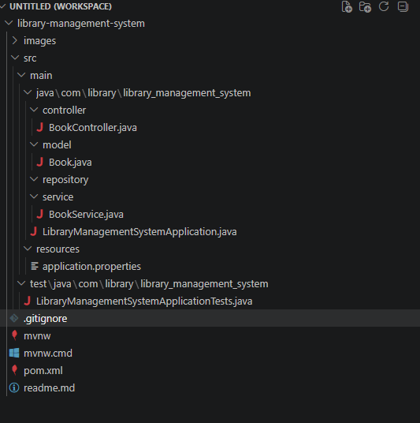
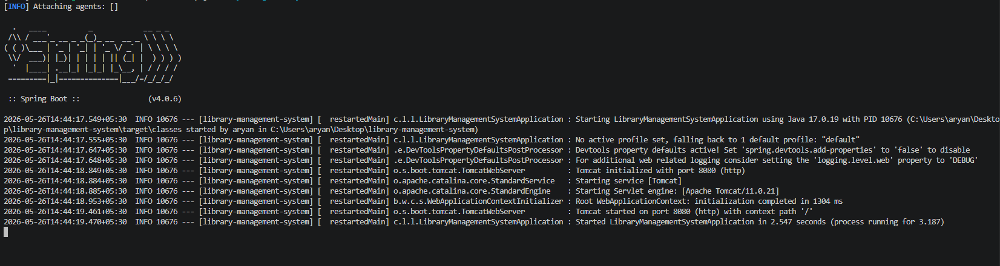
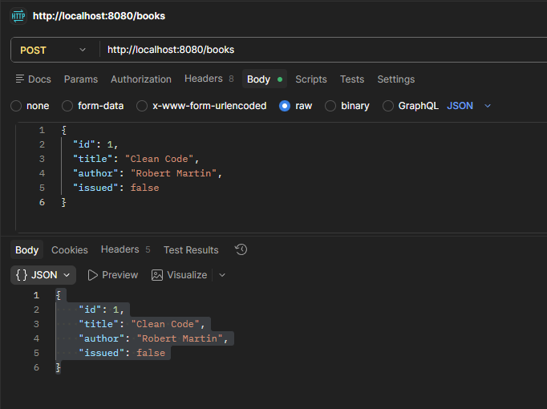
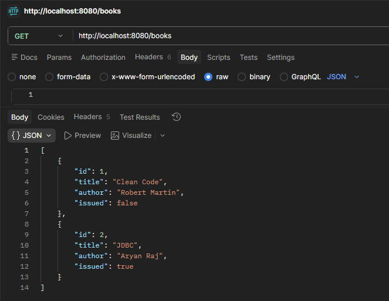
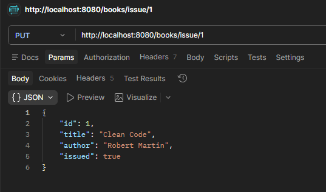
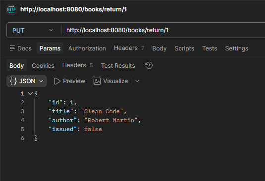
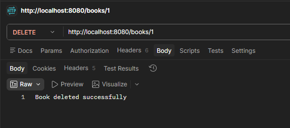

# Library Management System API

A beginner-friendly backend project built using Java and Spring Boot that provides REST APIs for managing books in a library system.

This project demonstrates backend development fundamentals such as REST APIs, CRUD operations, layered architecture, API testing using Postman, and Spring Boot application development.

---

# Features

- Add books
- View all books
- Get book by ID
- Issue books
- Return books
- Delete books
- RESTful API architecture
- Layered backend design using Controller and Service layers

---

# Tech Stack

- Java 17
- Spring Boot
- Maven
- REST APIs
- Postman
- Git & GitHub

---

# Project Structure

```text
src/main/java/com/library/library_management_system

controller/
service/
model/
repository/
```

---

# API Endpoints

## Add Book

```http
POST /books
```

### Sample Request

```json
{
  "id": 1,
  "title": "Clean Code",
  "author": "Robert Martin",
  "issued": false
}
```

---

## Get All Books

```http
GET /books
```

---

## Get Book By ID

```http
GET /books/{id}
```

---

## Issue Book

```http
PUT /books/issue/{id}
```

---

## Return Book

```http
PUT /books/return/{id}
```

---

## Delete Book

```http
DELETE /books/{id}
```

---

# Run Project

## Clone Repository

```bash
git clone https://github.com/your-username/library-management-system.git
```

---

## Run Application

```bash
mvn spring-boot:run
```

Application runs on:

```text
http://localhost:8080
```

---

# Screenshots

## Project Structure



---

## Spring Boot Application Running



---

## Add Book API



---

## Get Books API



---

## Issue Book API



---

## Return Book API



---

## Delete Book API



---

# Learning Outcomes

This project helped in understanding:

- Spring Boot backend development
- REST API creation
- CRUD operations
- Layered architecture
- API testing using Postman
- Java OOP concepts
- Backend project structuring
- Git and GitHub workflows

---

# Future Improvements

- Database integration using MySQL
- Student management APIs
- Authentication and authorization
- Docker deployment
- Frontend integration